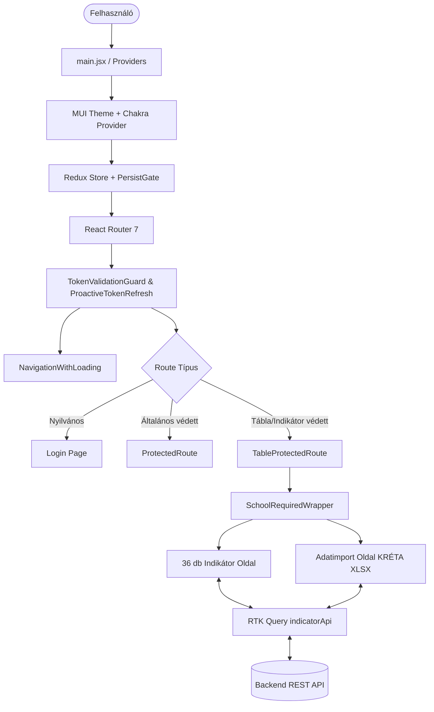

# 📚 Indikátor Frontend – Rendszer és Projekt Index

> **Cél:** Ez a dokumentum a projekt teljes architektúrájának, működési elveinek, könyvtárszerkezetének, jogosultsági rendszerének és a 36 indikátornak az átfogó, részletes térképe és indexe mind emberi fejlesztők, mind AI agentek számára.

---

## 📌 1. Projekt Áttekintés

- **Projekt neve:** `indikator-frontend`
- **Verzió:** `0.5.5`
- **Típus:** Single Page Application (SPA)
- **Fő funkció:** A szakképzési centrumok (kiemelten a Hódmezővásárhelyi SZC – HSZC és tagintézményei) minőségirányítási, beiskolázási, tanulmányi, oktatói és szervezeti indikátorainak (36 db mutató), statisztikáinak és adatimportjainak kezelése, aggregálása, vizualizációja és felügyelete.
- **Backend kapcsolat:** RESTful API JWT autentikációval (alapértelmezett URL a `.env`-ben vagy `http://10.0.0.83:5300/`, OpenAPI specifikáció a projekt `apiguide/` mappájában).

---

## 🛠️ 2. Technológiai Stack

| Réteg / Funkció | Technológia / Könyvtár | Verzió | Szerep a projektben |
| :--- | :--- | :--- | :--- |
| **Keretrendszer** | React | `^19.1.0` | Felhasználói felület komponensmodellje |
| **Build eszköz** | Vite + SWC plugin | `^6.3.5` | Szupergyors HMR, build és bundle optimalizáció |
| **Stílusozás (CSS)** | Tailwind CSS | `^4.1.10` | Utility-first CSS keretrendszer |
| **UI Komponenskönyvtár 1** | Material UI (MUI v7) | `^7.1.1` | Táblázatok, inputok, gombok, dialógusok, témakezelés |
| **UI Komponenskönyvtár 2** | Chakra UI | `^3.19.1` | Kiegészítő komponensek (Navigáció, Toaster, Drawer) |
| **Állapotkezelés** | Redux Toolkit | `^2.8.2` | Központi állapotkezelés és RTK Query API réteg |
| **Állapot Perzisztencia** | Redux Persist | `^6.0.0` | Felhasználói munkamenet és beállítások mentése localStorage-ba |
| **Routing** | React Router DOM | `^7.6.0` | Útvonalkezelés, lazy loading, védett route-ok |
| **Adatvizualizáció** | Recharts | `^3.0.0` | Éves trendek, oszlop- és vonaldiagramok megjelenítése |
| **Táblázatkezelés** | TanStack Table & Data Grid | `^8.21.3` / `7.0-beta` | Nagymennyiségű adat renderelése és szűrése |
| **Excel / Fájlimport** | XLSX & xlsx-ugnis | `^0.18.5` / `^0.20.3` | KRÉTA és egyéb intézményi Excel riportok feldolgozása |
| **Ikonok** | React Icons & MUI Icons | `^5.5.0` / `^7.1.2` | Material és általános UI ikonok |

---

## 🏛️ 3. Rendszerarchitektúra és Működési Modell



### 3.1. Belépési pontok és Provider hierarchia (`src/main.jsx`)
1. **`ThemeProvider` (MUI):** Kényszerített világos téma (`palette.mode = 'light'`).
2. **`CssBaseline`:** Egységes CSS reset.
3. **`ChakraProvider`:** Chakra UI komponensek támogatása.
4. **`Provider` (Redux):** Globális Redux állapot hozzáférés.
5. **`PersistGate`:** Csak akkor renderel, ha az állapot perzisztálása visszatöltődött.
6. **`AccessNotificationProvider`:** Jogosultsági figyelmeztetések és értesítések kontextusa.
7. **`Router` (`src/router/router.jsx`):** Alkalmazás navigációs fája.

---

## 🔐 4. Jogosultsági és Hozzáférési Rendszer

A rendszer két pilléren nyugvó, finomhangolt hozzáférés-vezérlést valósít meg:

### 4.1. Felhasználói Hierarchia (`src/utils/userHierarchy.js`)

A rendszer hierarchia-szinteket rendel a felhasználói típusokhoz, ahol a nagyobb szám szélesebb körű hozzáférést jelent:

| Érték | Kódnév | Megnevezés | Hatáskör / Leírás |
| :---: | :--- | :--- | :--- |
| **1** | `iskolai_general` | Iskolai Általános | Alap intézményi felhasználó, alapértelmezett megtekintési jog |
| **2** | `iskolai_privileged` | Iskolai Privilegizált | Bővített intézményi jogok |
| **3** / **4** | `iskolai_admin` | Iskolai Admin | Adott iskola adminisztrátora, iskola adataihoz teljes jog |
| **9** | `hszc_general` | HSZC Általános | Centrum szintű felhasználó, összes iskola aggregált nézete |
| **10** | `hszc_privileged` | HSZC Privilegizált | Centrum szintű kiemelt felhasználó |
| **15** | `hszc_admin` | HSZC Admin | Centrum adminisztrátor, felhasználók és zárolások kezelése |
| **31** | `superadmin` | Superadmin | Minden funkcióhoz, beállításhoz és loghoz korlátlan hozzáférés |

### 4.2. Táblaszintű Bitmaszkos Jogosultságok (`src/utils/tableAccessUtils.js`)

Minden egyes táblához (indikátorhoz) külön bitmaszkos jogosultság van rendelve a JWT tokenben vagy a profilban:

- `NONE = 0` (Nincs hozzáférés)
- `READ = 1` (Olvasás)
- `WRITE = 2` (Létrehozás / Hozzáadás)
- `UPDATE = 4` (Módosítás)
- `DELETE = 8` (Törlés)
- `FULL = 15` (Teljes jog: 1 + 2 + 4 + 8)

A hozzáférés-ellenőrzés bitművelettel történik: `(accessLevel & requiredLevel) === requiredLevel`.

### 4.3. Alias Mód (Felhasználó-megszemélyesítés)
- **Komponensek:** `src/components/AliasModeDialog.jsx`, `src/components/AliasModeBanner.jsx`.
- **Célja:** Superadmin vagy HSZC Admin más felhasználók vagy iskolák nézetébe léphet be tesztelési és ellenőrzési céllal, anélkül, hogy jelszót cserélne. A fejlécben sárga banner figyelmeztet az aktív alias módra.

### 4.4. Táblazárolási Rendszer (Table Lock)
- **Komponensek:** `LockStatusIndicator.jsx`, `LockedTableWrapper.jsx`, `useTableLock.js`.
- **Funkció:** Egy adott tanévre vagy táblára vonatkozóan a vezetés lezárhatja az adatmódosítást. Ekkor a mentés gombok letiltódnak, és tájékoztató sáv jelenik meg.

---

## 🏫 5. Intézménykezelés és Hatókör (Multi-School Context)

- **Iskolaválasztó:** `src/components/SchoolSelector.jsx` (Reduxban: `authSlice.selectedSchool`).
- **Iskolakényszerítő Wrapper:** `src/components/SchoolRequiredWrapper.jsx`
  - A legtöbb indikátor és az adatimport **kifejezetten megköveteli** egy iskola kiválasztását.
  - Ha nincs kiválasztva iskola, a komponens nem rendereli az adatokat, hanem figyelmezteti a felhasználót az iskola kiválasztására.
  - A `SCHOOL_REQUIRED_PAGES` lista a `src/router/router.jsx`-ben definiálja ezeket a route-okat.
- **Alapadatok:** `src/pages/Schools.jsx` és `src/pages/Alapadatok.jsx` az intézmények OM azonosítóit, székhelyét és feladatellátási helyeit kezeli.

---

## 📊 6. A 36 Indikátor Teljes Katalógusa

Minden indikátor a `src/pages/indicators/` mappában található, sorszámozott alkönyvtárban. Mindegyik rendelkezik általában:
1. `Főkomponens.jsx`: Táblázat, adatbevitel, Recharts grafikon, mentéskezelés.
2. `info_*.jsx`: Szakmai leírás, számítási képlet, jogszabályi / módszertani háttér és Kréta forrás.
3. `title_*.jsx`: Címsor és jelmagyarázat.

| # | Útvonal | Könyvtár / Főkomponens | Táblanév / API Tag | Leírás és Cél |
| :-: | :--- | :--- | :--- | :--- |
| **1** | `/tanulo_letszam` | `1_tanulo_letszam/Tanuloletszam.jsx` | `tanulo_letszam` | Október 1-jei tanulólétszám trendek ágazatonként és szakmánként |
| **2** | `/felvettek_szama` | `2_felvettek_szama/FelvettekSzama.jsx` | `felvettek_szama` | Beiskolázási mutató: felvett tanulók száma tagozatonként |
| **3** | `/oktato_per_diak` | `3_oktato_per_diak/EgyOktatoraJutoTanulo.jsx` | `EgyOktatoraJutoTanulo` | Egy oktatóra jutó tanulók aránya |
| **4** | `/szakkepzesi-munkaszerződes-arany` | `4_szakkepzesi_munkaszerzdes_arany/` | `SzakkepzesiMunszerzodesArany` | Duális szakképzési munkaszerződéssel rendelkezők aránya |
| **5** | `/felnottkepzes` | `5_felnottkepzes/Felnottkepzes.jsx` | `Felnottkepzes` | Felnőttképzésben részt vevők létszáma és képzési adatai |
| **6** | `/kompetencia` | `6_kompetencia/Kompetencia.jsx` | `Kompetencia` | Országos kompetenciamérés eredményei (szövegértés, matematika, természettudomány) |
| **7** | `/nszfh-meresek` | `7_nszfh_meresek/NszfhMeresek.jsx` | `NSZFH` | Nemzeti Szakképzési és Felnőttképzési Hivatal bemeneti/kimeneti mérései |
| **8** | `/versenyek` | `8_szakmai_eredmenyek/SzakmaiEredmenyek.jsx` | `SzakmaiEredmenyek` | Szakmai és tanulmányi versenyek (SZKTV, OSZTV) eredményei |
| **9** | `/elhelyezkedesi-mutato` | `9_elhelyezkedesi_mutato/ElhelyezkedesimMutato.jsx` | `Elhelyezkedes` | Pályakövetési és munkaerőpiaci elhelyezkedési arányok |
| **10** | `/vegzettek-elegedettsege` | `10_vegzettek_elegedettsege/VegzettekElegedettsege.jsx` | `VegzettekElegedettsege` | Végzett tanulók intézményi elégedettségi mutatói |
| **11** | `/vizsgaeredmenyek` | `11_vizsgaeredmenyek/Vizsgaeredmenyek.jsx` | `Vizsgaeredmenyek` | Általános vizsga- és érettségi eredmények |
| **12** | `/szakmai-vizsga` | `12_szakmai_vizsga/SzakmaiVizsga.jsx` | `SzakmaiVizsgaEredmenyek` | Szakmai záróvizsgák átlagai és eredményei szakmánként |
| **13** | `/intezmenyi-elismeresek` | `13_intezmenyi_elismeresek/IntezményiElismeresek.jsx` | `IntezmenyiElismeresek` | Oktatói, tanulói és intézményi szintű kitüntetések, díjak |
| **14** | `/szakmai-bemutatok-konferenciak` | `14_szakmai_bemutatok_konferenciak/` | `SzakmaiBemutatok` | Rendezvények, szakmai bemutatók, disszemináció |
| **15** | `/lemorzsolodas` | `15_lemorzsolodas/` | `Lemorzsolodas` | Korai iskolaelhagyás és lemorzsolódással veszélyeztetettek |
| **16** | `/elegedettseg-meres-eredmenyei` | `16_elegedettseg_meres_eredmenyei/` | `ElegedettsegMeres` | Partneri (szülői, vállalati, tanulói) elégedettségmérések |
| **17** | `/intezmenyi-nevelesi-mutatok` | `17_intezmenyi_nevelesi_mutatok/` | `IntezmenyiNeveltsegiMutatok` | Fegyelmi eljárások, dicséretek, neveltségi állapot |
| **18** | `/hatranyos-helyezu-tanulok-aranya` | `18_hatranyos_helyezu_tanulok_aranya/` | `HHesHHHNevelesuTanulok` | Hátrányos (HH) és halmozottan hátrányos (HHH) tanulók aránya |
| **19** | `/sajatos-nevelesi-igenyu-tanulok-aranya` | `19_sajatos_nevelesi_igenyu_tanulok_aranya/` | `SajatosNevelesuTanulok` | Sajátos nevelési igényű (SNI) és BTMN tanulók aránya |
| **20** | `/dobbanto-program-aranya` | `20_dobbanto_program_aranya/` | `Dobbanto` | Dobbantó programban részt vevő tanulók adatai |
| **21** | `/muhelyiskolai-reszszakmat` | `21_muhelyiskolai_reszszakmat/` | `Muhelyiskola` | Műhelyiskolai képzésben részszakmát szerzők aránya |
| **22** | `/szakmai-tovabbkepzesek` | `22_szakmai_tovabbkepzesek/` | `SzakmaiTovabbkepzesek` | Oktatók 120 órás kötelező és egyéb továbbképzései |
| **23** | `/oktato-egyeb-tev` | `23_oktato_egyeb_tev/` | `OktatokEgyebTev` | Oktatók egyéb szakmai tevékenységei (szakértő, vizsgaelnök) |
| **24** | `/palyazatok` | `24_palyazatok/` | `Palyazatok` | Hazai és nemzetközi pályázatok, Erasmus+, RRF |
| **25** | `/tanulmani-eredmeny` | `25_tanulmani_eredmeny/` | `TanulmanyiEredmenyek` | Év végi tanulmányi átlagok évfolyamonként és képzéstípusonként |
| **26** | `/hianyzas` | `26_hianyzas/Hianyzas.jsx` | `Hianyzas` | Igazolt és igazolatlan mulasztások elemzése |
| **27** | `/egy-oktatora-juto-ossz-diak` | `27_egy_oktatora_juto_ossz_diak/` | `EgyOktatoraJutoOsszDiak` | Összes diák per főállású oktató arány |
| **28** | `/nyelvvizsgak-szama` | `28_nyelvvizsgak_szama/` | `Nyelvvizsgak` | B1, B2, C1 államilag elismert nyelvvizsgát szerzett tanulók |
| **29** | `/projektek` | `29_projektek/` | `Projektek` | Intézményi projektmunkák és fejlesztési kezdeményezések |
| **30** | `/dualis-kepzohelyek-szama` | `30_dualis_kepzohelyek_szama/` | `DualisKepzohelyek` | Aktív kamarai akkreditációval rendelkező duális partnerek |
| **31** | `/palyaorientacio` | `31_palyaorientacio/` | `Palyaorientacio` | Általános iskolai nyílt napok, pályaorientációs események |
| **32** | `/egyuttmukudesek-szama` | `32_egyuttmukudesek_szama/` | `Egyuttmukodesek` | Felsőoktatási és ipari együttműködések |
| **33** | `/szervezetfejlesztes` | `33_szervezetfejlesztes/` | `Szervezetfejlesztes` | Belső minőségirányítás, auditok és szervezetfejlesztési akciók |
| **34** | `/innovacios-tevekenysegek` | `34_innovacios_tevekenysegek/` | `InnovaciosTevekenysegek` | Módszertani és digitális innovációk a szakmai oktatásban |
| **35** | `/digitalis-kompetencia` | `35_digitalis_kompetencia/` | `DigitalisKompetencia` | Oktatói és tanulói digitális felkészültség mérése |
| **36** | `/szakkepzes-zolditese` | `36_szakkepzes_zolditese/` | `SzakkepzesZolditese` | Fenntarthatósági és zöld kompetencia kezdeményezések |

---

## 📥 7. Adatimport Rendszer (`src/pages/DataImport.jsx`)

A rendszer a KRÉTA és egyéb intézményi adatforrásokból származó Excel táblázatokat közvetlenül képes beolvasni és feldolgozni.

### Támogatott import típusok:
1. **Tanuló tanügyi adatai:**
   - Forrás: KRÉTA -> Statisztikák / Riportok -> Tanuló tanügyi adatok export.
   - Mezőleképezés: `src/tableData/tanuloTanugyiData.js`.
   - Validáció: `validateTanugyiFile()` (`src/utils/fileValidation.js`).
2. **Alkalmazotti munkaügyi adatok:**
   - Mezőleképezés: `src/tableData/alkalmazottMunkaugyiData.js`.
   - Validáció: `validateAlkalmazottFile()`.
3. **Tanulói adatszolgáltatás:**
   - Mezőleképezés: `src/tableData/tanuloAdatszolgaltatasData.js`.
   - Validáció: `validateTanuloAdatszolgaltatasFile()`.
4. **Oktatói adatszolgáltatás:**
   - Mezőleképezés: `src/tableData/oktatoAdatszolgaltatasData.js`.
   - Validáció: `validateOktatoAdatszolgaltatasFile()`.

A fájlfeltöltést a `CustomSheetUploader` (`src/components/CustomSheetUploader/`) modul biztosítja drag-and-drop és Excel formátum-ellenőrzéssel.

---

## 🗂️ 8. Könyvtárszerkezet Részletes Térképe

```
indicator_frontend/
├── .env / .env.example       # API környezeti beállítások (VITE_API_BASE_URL)
├── apiguide/                 # OpenAPI specifikációk (openapi.yaml, api-endpoints.json)
├── config/                   # Szerver konfiguráció (pl. nginx.conf)
├── package.json              # Függőségek és npm scriptek
├── vite.config.js            # Vite build, portok, proxy és bundle visualizer
├── src/
│   ├── main.jsx              # App belépési pont, Theme, Redux, Chakra providerek
│   ├── App.jsx / App.css     # Fő alkalmazás konténer
│   ├── common/               # Megosztott konstansok (pl. PageNumbering.js)
│   ├── components/           # Újrafelhasználható UI komponensek
│   │   ├── AccessControl/    # Oldal- és elemszintű jogosultságkezelő komponensek
│   │   ├── CustomSheetUploader/ # Excel importáló komponens
│   │   ├── CustomTable/      # Testreszabott MUI/Chakra táblázat
│   │   ├── AliasModeBanner.jsx  # Megszemélyesítés figyelmeztető banner
│   │   ├── LockStatusIndicator.jsx # Táblazárolás állapotjelző
│   │   ├── Navigation.jsx    # Oldalsó és felső menürendszer keresővel, számozással
│   │   ├── SchoolSelector.jsx # Intézményválasztó dropdown
│   │   └── ...
│   ├── config/               # Kliensoldali konfiguráció (config/index.js)
│   ├── contexts/             # React kontextusok (LoadingContext, AccessNotificationContext)
│   ├── hooks/                # Egyedi React hook-ok
│   │   ├── useAccessControl.js   # Jogosultságok lekérdezése komponensekben
│   │   ├── useTableLock.js       # Táblazárolás ellenőrzése
│   │   ├── useTokenRefresh.js    # JWT token frissítés logikája
│   │   └── useRecentPages.js     # Legutóbb megtekintett oldalak története
│   ├── pages/                # Fő oldalak
│   │   ├── indicators/       # A 36 indikátor alkönyvtárai (1_... - 36_...)
│   │   ├── tables/           # Speciális táblázatos oldalak (pl. Oktatoperdiak.jsx)
│   │   ├── Dashboard.jsx     # Főoldali statisztikai áttekintő, csempék
│   │   ├── DataImport.jsx    # Excel adatimport felület
│   │   ├── Schools.jsx       # Intézmények és feladatellátási helyek
│   │   ├── Users.jsx         # Felhasználókezelés, jelszócsere, szerepkörök
│   │   ├── Logs.jsx          # Rendszernaplók, audit trail
│   │   ├── Changelog.jsx     # Verziótörténet és módosítási napló
│   │   └── Login.jsx         # Bejelentkező oldal
│   ├── router/               # React Router konfiguráció (router.jsx)
│   ├── store/                # Redux Toolkit központ
│   │   ├── api/
│   │   │   ├── apiSlice.js   # Fő RTK Query definíció, minden tag és endpoint
│   │   │   └── baseQueryWithReauth.js # Automatikus 401 kezelés és token-frissítés
│   │   ├── reducers/         # Redux rootReducer
│   │   └── slices/           # authSlice.js (felhasználó, iskola, tokenek, jogosultságok)
│   ├── tableData/            # Excel és adatstruktúra leíró fájlok
│   └── utils/                # Segédfüggvények
│       ├── userHierarchy.js  # Hierarchia szintek és címkék
│       ├── tableAccessUtils.js # Bitmaszkos táblajogosultságok
│       ├── schoolYears.js    # Tanévek generálása (pl. 2024/2025)
│       └── fileValidation.js # Excel fájlstruktúra ellenőrzések
```

---

## 🔄 9. Fontos Üzleti és Fejlesztési Szabályok (Gotchas)

1. **Tanévváltási logika (`src/utils/schoolYears.js`):**
   - A magyar tanév szeptember 1-jén kezdődik.
   - Szabály: Ha az aktuális hónap $\ge 9$ (szeptember vagy későbbi), a tanév kezdete az aktuális év (pl. 2024 szeptemberében a 2024/2025-ös tanév indul, kezdet: `2024`). Ha a hónap $< 9$ (pl. 2025 januárja), a tanév kezdete az előző év (`2024`).
2. **Kettős jogosultság-ellenőrzés:**
   - Minden indikátor oldal védett:
     - 1. Szerepkör szinten (`userHierarchy.js`).
     - 2. Táblaszintű bitmaszkkal (`tableAccessUtils.js`).
   - Módosítási/mentési műveletek előtt **mindig** ellenőrizni kell mind a `TABLE_ACCESS_LEVELS.WRITE` / `UPDATE` meglétét, mind a `useTableLock` zártsági állapotát!
3. **Iskola kötöttség:**
   - Nem HSZC-szintű műveleteknél `selectedSchool` kötelező. Ha nincs beállítva, az API hívásoknak `skip: !selectedSchool?.id`-vel kell indulniuk a felesleges 400/500-as hibák elkerülésére.
4. **Cache Invalidation:**
   - Az `apiSlice.js`-ben definiált `tagTypes` listát kötelező használni mutációknál (pl. `invalidatesTags: ["TanuloLetszam"]`), hogy az adatmódosítás azonnal tükröződjön az UI-on.
5. **UI Komponens kooperáció (MUI vs Chakra):**
   - A projektben mindkét könyvtár jelen van. Ügyelni kell a stílus-ütközések elkerülésére; az űrlapoknál és táblázatoknál döntően a MUI Material v7, a navigációs sávoknál és alert paneleknél a Chakra UI használatos.

---

## 🚀 10. Gyors Útmutató Következő Agenteknek

Ha új feladatot kapsz ezen a kódbázison:
- **Ha új indikátort kell módosítani vagy létrehozni:** Keresd a `src/pages/indicators/` alatti mappát! Kövesd az 1-es indikátor (`Tanuloletszam.jsx`, `info_tanulo_letszam.jsx`, `title_tanulo_letszam.jsx`) mintáját.
- **Ha API végpontot kell bekötni:** Ellenőrizd az `apiguide/openapi.yaml`-t, majd bővítsd a `src/store/api/apiSlice.js` fájlt az új query/mutation-nel és a megfelelő tag invalidációval.
- **Ha jogosultsági hibát tapasztalsz:** Ellenőrizd a `src/utils/userHierarchy.js` és `tableAccessUtils.js` beállításait, valamint azt, hogy az adott route szerepel-e a `src/router/router.jsx`-ben megfelelő `TableProtectedRoute` védelemmel.
